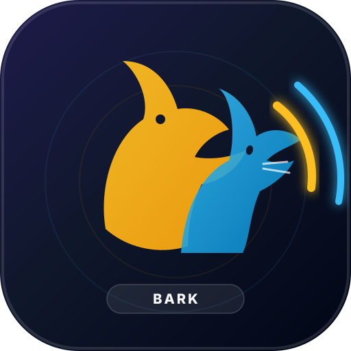

# Bark 🐕 🐱

Bark is a zero-dependency, 100% client-side Progressive Web App (PWA) designed to play authentic dog barks and cat meow sounds directly on smartphones **completely offline without an internet connection**.

Built with modern mobile ergonomics, Web Audio API, and tactile visual feedback.



---

## Key Features

- ✈️ **100% Air-Gapped & Offline Ready**: Once loaded or added to your phone's home screen, works completely in Airplane Mode. All audio files and assets are precached by a local Service Worker (`sw.js`) with zero CDN or cloud dependencies.
- 🐕 **8 Realistic Dog Vocalizations**:
  - **Big Dog Woof**: Deep, resonant bark of a large breed (German Shepherd / Mastiff).
  - **Guard Dog Warning**: Fierce repeated alert barks guarding territory.
  - **Angry Snarl**: Defensive growl transitioning into sharp warning barks.
  - **Toy Poodle Yip**: High-energy, bright yapping from a small pup.
  - **Mini Dachshund**: Curious, lively indoor barks.
  - **Fast Alarm Barks**: Rapid staccato barking signaling door visitors.
  - **Playful Woof**: Cheerful tail-wagging greeting ready for fetch.
  - **Wolf / Husky Howl**: Majestic, soul-stirring wild canine howl.
- 🐱 **8 Authentic Cat Vocalizations**:
  - **Classic Meow**: Standard friendly domestic greeting meow.
  - **Tiny Kitten Squeak**: Sweet, high-pitched tender newborn kitten mew.
  - **Soothing Purr**: Deep continuous rhythmic vibration for relaxation.
  - **Defensive Hiss**: Sharp air release and warning spit from a startled feline.
  - **Hungry Demand**: Urgent, persistent dinnertime meow for wet food.
  - **Bird-Watcher Chirp**: Excited chattering and trilling at window birds.
  - **Dramatic Yowl**: Loud, long-distance nighttime alley caterwaul.
  - **Doorstep Mew**: Polite greeting asking to open the bedroom door.
- ⚡ **Zero-Latency Touch Response**: Every audio file is pre-trimmed using acoustic RMS onset detection to eliminate leading silence so sounds trigger instantaneously upon tapping.
- 🎛️ **Pitch & Continuous Loop Controls**:
  - Modulate vocal pitch across Deep (0.75x), Normal (1.0x), and High (1.3x) frequencies.
  - Continuous loop toggle for soothing background cat purrs or persistent watchdog security barking.
- 🔊 **Ultrasonic Dog Whistle**: Adjustable high-frequency sine generator (12,000 Hz to 22,000 Hz) leveraging the Web Audio API for pet recall and canine attention.
- ⏱️ **Delayed Prank Timer**: Arm a 3s, 5s, 10s, or 30s countdown timer to place your phone across the room and surprise friends or pets.
- 📊 **Real-Time Oscilloscope Visualizer**: Canvas-based audio waveform oscilloscope dynamically reacting to playing frequencies.
- 📳 **Haptic Feedback**: Tactile vibration micro-interactions on mobile devices.

---

## Offline Audio Asset Generation Pipeline

The audio assets in `sounds/` are statically stored and were generated/prepared offline using the bundled Python pipeline script:

```bash
# Requires Python 3 and FFmpeg
python3 scripts/generate_sounds.py
```

### What the script does:
1. Downloads authentic CC-licensed recordings from the [ESC-50 Dataset](https://github.com/karolpiczak/ESC-50) and Wikimedia Commons.
2. Performs automated RMS energy analysis to detect the precise onset time of the vocalization, eliminating dead air before the sound.
3. Applies a 30ms attack fade-in and 200ms decay fade-out to prevent clicks and pops.
4. Normalizes audio to broadcast loudness standards using FFmpeg's `loudnorm` filter (`-16 LUFS`).
5. Encodes into lightweight 96kbps MP3s (average ~28 KB per sound, entire 16-sound bundle is under 470 KB).

---

## How to Test Locally

Start a simple local web server with Python:

```bash
python3 -m http.server 8000
```

Open `http://localhost:8000` in your browser.

To test on your smartphone over your local Wi-Fi:
```bash
# Find your computer's local IP address
ifconfig | grep "inet " | grep -v 127.0.0.1
```
Open `http://<your-computer-ip>:8000` on your smartphone browser.

---

## How to Deploy to GitHub Pages

1. Create a repository on GitHub (e.g. `bark`).
2. Add your GitHub remote and push the code:
   ```bash
   git remote add origin https://github.com/<your-username>/bark.git
   git branch -M main
   git push -u origin main
   ```
3. In your GitHub repository:
   - Go to **Settings** > **Pages**.
   - Under **Build and deployment** > **Source**, select **Deploy from a branch**.
   - Select branch `main` and folder `/ (root)`.
   - Click **Save**.
4. Your app will be live at `https://<your-username>.github.io/bark/`.

> **Tip for Offline PWA Installation**:
> - **iOS (Safari)**: Tap the **Share** icon → select **Add to Home Screen**.
> - **Android (Chrome)**: Tap the **⋮** menu → select **Install app** or **Add to Home screen**.
>
> Once installed, you can launch Bark directly from your home screen and turn on Airplane Mode — it works 100% offline!

---

## License & Acknowledgments

Bark is open-source under the [MIT License](LICENSE).

### Audio Credits & Licenses
The statically stored audio files in `sounds/` are derived from open, Creative Commons-licensed recordings:
- **ESC-50 Dataset** by Karol J. Piczak — Licensed under **CC-BY 3.0** / **CC0** / **CC-BY-NC 3.0** (Freesound contributors: nfrae, InDaHouse20, polipa, fabiopx, Ligidium, LittleBigSounds, Heigh-hoo, sazman, YuriVoorhak, dobroide, aminut, Zabuhailo).
- **Wolf Howl** by U.S. Fish and Wildlife Service via Wikimedia Commons — **Public Domain**.
- **Purring Cat** by Mysid via Wikimedia Commons — **Public Domain**.
- **Cat Hissing** by Zabuhailo via Wikimedia Commons — **CC-BY 3.0**.
