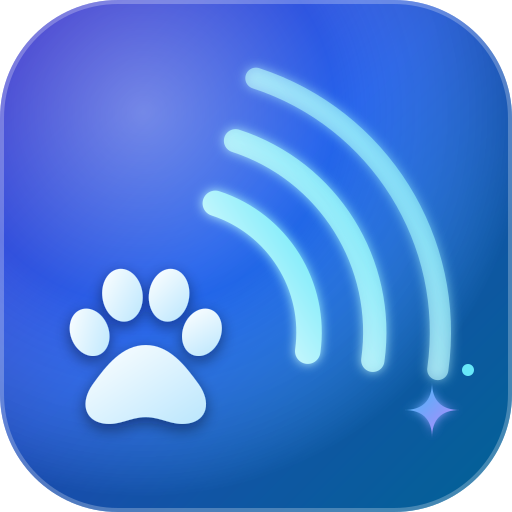

# Bark 🐕 🐱

Bark is part of the same app family as Mobile LaTeX, AirCopy, 农历 and 漢字 (shared look and icon style). It is a zero-dependency, 100% client-side Progressive Web App (PWA) designed to play authentic dog barks and cat meow sounds directly on smartphones **completely offline without an internet connection**.

Built with modern mobile ergonomics, Web Audio API, and tactile visual feedback.



---

## Key Features

- ✈️ **100% Air-Gapped & Offline Ready**: Once loaded or added to your phone's home screen, works completely in Airplane Mode. All audio files and assets are precached by a local Service Worker (`sw.js`) with zero CDN or cloud dependencies.
- 👆 **One Tap = One Bark**: every button plays a single, trimmed bark or meow. Quick taps overlap naturally, and each animal rotates through up to four real takes so repeated taps don't sound robotic.
- 🐕 **Dogs**: Big Dog, Guard Dog, Springer Spaniel, Shih Tzu Pug, Mini Dachshund, Poodle, Yappy Pup, Wolf Howl.
- 🐱 **Cats**: Classic Meow, Loud Meow, Hungry Cat, Soft Meow, Little Mew, Mad Cat Yowl, Purr, Hiss.
- ⚡ **Instant Response**: sounds are short WAV files decoded once with the Web Audio API, so playback starts immediately (no MP3 encoder delay). On older iPhones without the Audio Session API, HTML5 audio is used so sound still plays with the Silent Switch on.
- 🎛️ **Pitch Control**: Deep (0.75×), Normal, High (1.3×) shifts the voice like a bigger or smaller animal.
- 🔊 **Ultrasonic Dog Whistle**: Adjustable high-frequency sine generator (12,000 Hz to 22,000 Hz) leveraging the Web Audio API for pet recall and canine attention.
- ⏱️ **Delayed Prank Timer**: Arm a 3s, 5s, 10s, or 30s countdown timer to place your phone across the room and surprise friends or pets.
- 📊 **Real-Time Oscilloscope Visualizer**: Canvas-based audio waveform oscilloscope dynamically reacting to playing frequencies.
- 📳 **Haptic Feedback**: Tactile vibration micro-interactions on mobile devices.

---

## Sound Generation Pipeline

The files in `sounds/` are built by:

```bash
# Requires Python 3 with numpy and scipy (no ffmpeg needed)
python3 scripts/generate_sounds.py
```

What the script does:
1. Downloads source clips from the [ESC-50 dataset](https://github.com/karolpiczak/ESC-50), using only clips whose individual license (per ESC-50's `LICENSE` file) is **CC0** or **CC BY**.
2. Detects each bark / meow by RMS energy and cuts it out with a 20 ms pre-roll and its natural decay, stopping before the next one.
3. Skips faint, distant or clipped takes and keeps up to four of the strongest per animal.
4. Resamples to 32 kHz, high-passes at 70 Hz, matches loudness across all sounds with a −1 dBFS peak ceiling (no limiter, so no distortion), and adds 3 ms / 40 ms fades.
5. Writes 16-bit mono WAVs (~1.3 MB in total) and `sounds/sounds.json`, the catalog the app loads.

The wolf howl, purr and hiss MP3s are older files kept as-is (not regenerated by the script).

---

## How to Test Locally

Start a simple local web server with Python:

```bash
python3 -m http.server 8000
```

Open `http://localhost:8000` in your browser.

To test on your smartphone over your local Wi-Fi:
```bash
# Find your computer's local IP address
ifconfig | grep "inet " | grep -v 127.0.0.1
```
Open `http://<your-computer-ip>:8000` on your smartphone browser.

---

## How to Deploy to GitHub Pages

1. Create a repository on GitHub (e.g. `bark`).
2. Add your GitHub remote and push the code:
   ```bash
   git remote add origin https://github.com/<your-username>/bark.git
   git branch -M main
   git push -u origin main
   ```
3. In your GitHub repository:
   - Go to **Settings** > **Pages**.
   - Under **Build and deployment** > **Source**, select **Deploy from a branch**.
   - Select branch `main` and folder `/ (root)`.
   - Click **Save**.
4. Your app will be live at `https://<your-username>.github.io/bark/`.

> **Tip for Offline PWA Installation**:
> - **iOS (Safari)**: Tap the **Share** icon → select **Add to Home Screen**.
> - **Android (Chrome)**: Tap the **⋮** menu → select **Install app** or **Add to Home screen**.
>
> Once installed, you can launch Bark directly from your home screen and turn on Airplane Mode — it works 100% offline!

---

## License & Acknowledgments

Bark is open-source under the [MIT License](LICENSE).

### Audio Credits & Licenses

Recordings were trimmed and level-matched. The same list is shown in the app under **About → Sound credits**.

- **Big Dog**: Big_dog_bark_01.aiff by pgonsilva (freesound.org/s/182395), CC BY
- **Guard Dog**: Dog Barks.wav by UnderlinedDesigns (freesound.org/s/191687), CC0
- **Springer Spaniel**: animals_dog_bark_springer_spaniel_001.wav by soundscalpel.com (freesound.org/s/110389), CC BY
- **Shih Tzu Pug**: Dog Barking - Shih Tzu Pug by bspiller5 (freesound.org/s/180256), CC BY
- **Mini Dachshund**: Miniature Dachshund Bark - Indoors.wav by Ligidium (freesound.org/s/192236), CC0
- **Poodle**: one bark of a poodle dog by fabiopx (freesound.org/s/170015), CC0
- **Yappy Pup**: Dog bark2.wav by MisterTood (freesound.org/s/9032), CC0
- **Wolf Howl**: Wolf howls, U.S. Fish and Wildlife Service via Wikimedia Commons (public domain)
- **Classic Meow**: Cat meowing x5 by peridactyloptrix (freesound.org/s/214759), CC0
- **Loud Meow**: Cat.mp3 by telesik (freesound.org/s/172639), CC BY
- **Hungry Cat**: 20100423.hungry.cats.02.wav / .05.wav by dobroide (freesound.org/s/95695, /95698), CC BY
- **Soft Meow**: garage cat 01.wav by Kyster (freesound.org/s/82274), CC BY
- **Little Mew**: 20100423.hungry.cats.04.wav by dobroide (freesound.org/s/95697), CC BY
- **Mad Cat Yowl**: MAD CAT !.wav by temawas (freesound.org/s/133047), CC0
- **Purr**: Purring cat by Mysid via Wikimedia Commons (public domain)
- **Hiss**: Cat hissing by Zabuhailo via Wikimedia Commons (CC BY 3.0)
